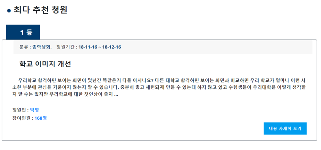

# 학교 청원사이트

# 목차
- 개발 목표
- 개발 환경
- 핵심 기능
- 서비스 현황

# 개발 목표
교내 문제를 해결할 수 있는 교내 청원사이트를 NodeJS로 개발하고자 함

청와대 청원사이트를 참고해서 학교에 필요한 기능들을 정리해서 구현함

정해진 동의수가 넘으면 학교 관계자가 이를 동영상이나 답변글로 답변할 수 있도록 함

이를 가지고 창업동아리 아이템 발표회에서 우수상을 수상하였음

# 개발 환경
- Node Js, Html, Css, Bootstrap
- 사용자 관리 : Firebase
- DB : MongoDB, Mysql

# 핵심 기능
- Firebase로 로그인 기능을 구현해 사용자 정보를 안전하게 관리
- 청원을 작성하고 한 청원에 아이디당 최대 1개의 동의를 할 수 있음(MongoDB로 관리)
- 동의 수가 넘으면 학교 관계자가 동영상 혹은 답변글로 답변할 수 있음
- Bootstrap을 이용해 모바일로 접속해도 사용하기 편리함
- 이외 학생들과 미팅을 주선해주는 기능, 학교 축제, 맛집 홈페이지들과 결합해서 여러 기능을 사용할 수 있음

# 서비스 현황
- 홈페이지 : siri-b.com (현재 서버가 없어져서 접속되지 않습니다.)
- github에는 청원홈페이지만 작성되어 있고, 이외으 홈페이지 기능은 gitlab에 작성되어 있습니다.
